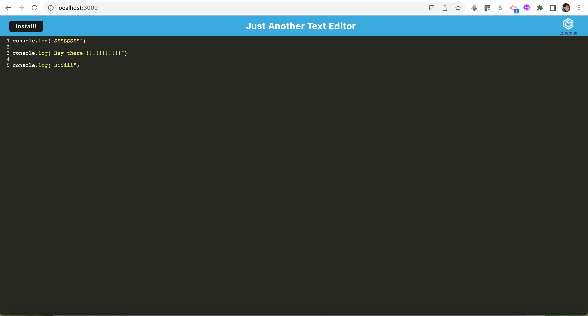
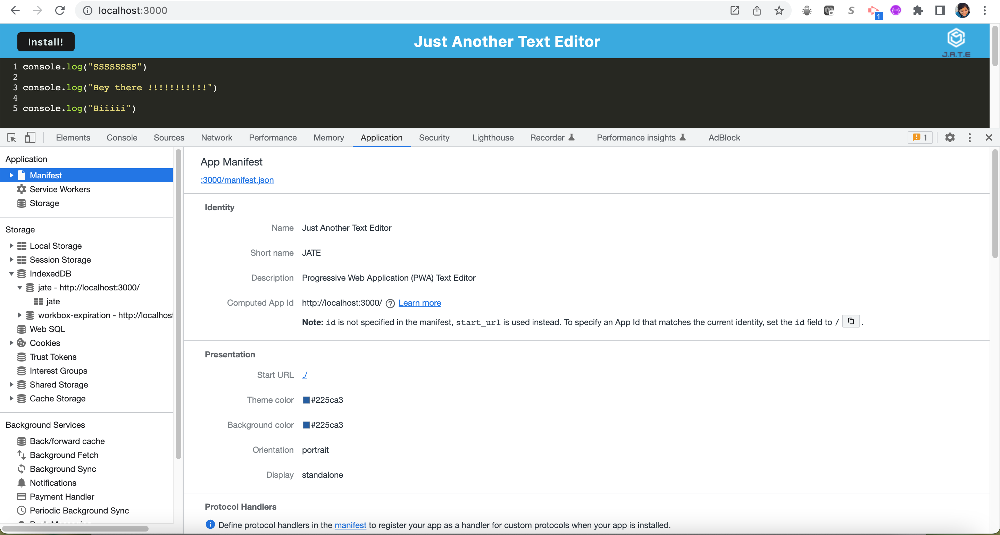
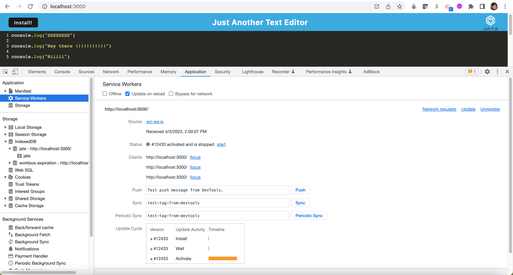
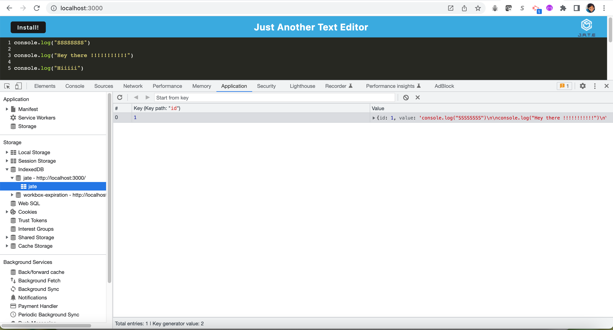

# pwa-text-editor

## Description 

This is a text editor that runs in the browser, it is a single-page application that meets the PWA criteria. It also has a number of data persistence techniques that serve as redundancy in case one of the options is not supported by the browser. The application will also function offline.

The application can be invoked by using 'npm run start' command. 

* The repo has a client server folder structure.
* When you invoke the app using `npm run start` from the root directory then the application should start up the backend and serve the client.
* When you run the app from terminal then you can see that the JavaScript files have been bundled using webpack. You can also see the generated HTML file, service worker, and a manifest file.
* When you open the app in browser and inspect, you can see that the IndexedDB has created a database storage.
* When you enter content and subsequently click off of the DOM window then the content in the text editor gets saved within the IndexedDB.
* When you close and reopen the app then the content in the text editor gets retrieved from the IndexedDB.
* When you click on the 'Install' button then the app is downloaded as an icon on desktop.
* When you load the app then you should see a registered service worker using workbox.
* When you register a service worker then you should have static assets pre cached upon loading along with subsequent pages and static assets.
* When it's deployed to Heroku then you should have proper build scripts for a webpack application.

## Features

* The features are same as explained in the description, please refer above.

## Installation

N/A

## Screenshot

* Please see the screenshots below

## Link to the GitHub repo of the application

https://github.com/suvarna28/pwa-text-editor

## Link to the deployed application on Heroku

## Credits

* All the module activities and mini project.
